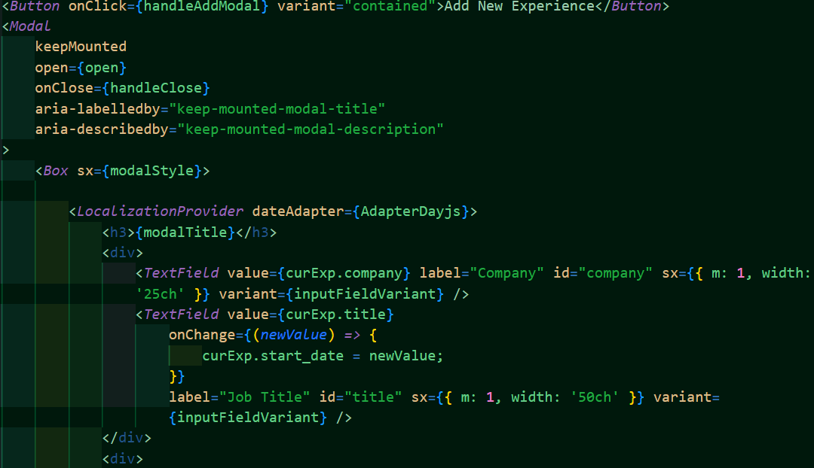

# Resumator

The Resumator was created to help users cerate a ready-to-use resume.

## Description

The Resumator aides users in creating, updating, maintaining, and deleting a fully formatted resume using several different templates. After either logging in or creating an account, the website allows users to input a variety of different information, such as contact information, skills, work experience, education, projects, and languages/awards/other. Once the information is entered into the system, a fully formatted resume will be formed for users to look at.

## Technologies Used

- React
- MUI
- mongoDB
- React-router
- Redux
- graphQL

## Usage and Website

[Resumator](https://github.com/kirstgonz/resumator) helps users keep track of their resume. Users are able to edit and remove data from the website. This data is then added to their resume, which they can choose from different templates. No installation is required for this program. It can be found deployed [here]().

Below is the front page of the website that users see upon visiting.

Below is a little bit of code for importing different assets and setting some constants.

Below is an example of the code used to generate adding a work experience.

## Credits

Built by 
[Ashwini LH](https://github.com/ashwinilh)
[Kate Lam](https://github.com/Kate-github)
[Todd Holley](https://github.com/ChucktownTiger)
[JP Maldonado](https://github.com/jpboo888)
[Kirstyn Gonzalez](https://github.com/kirstgonz)

## License

[https://choosealicense.com/](https://choosealicense.com/).